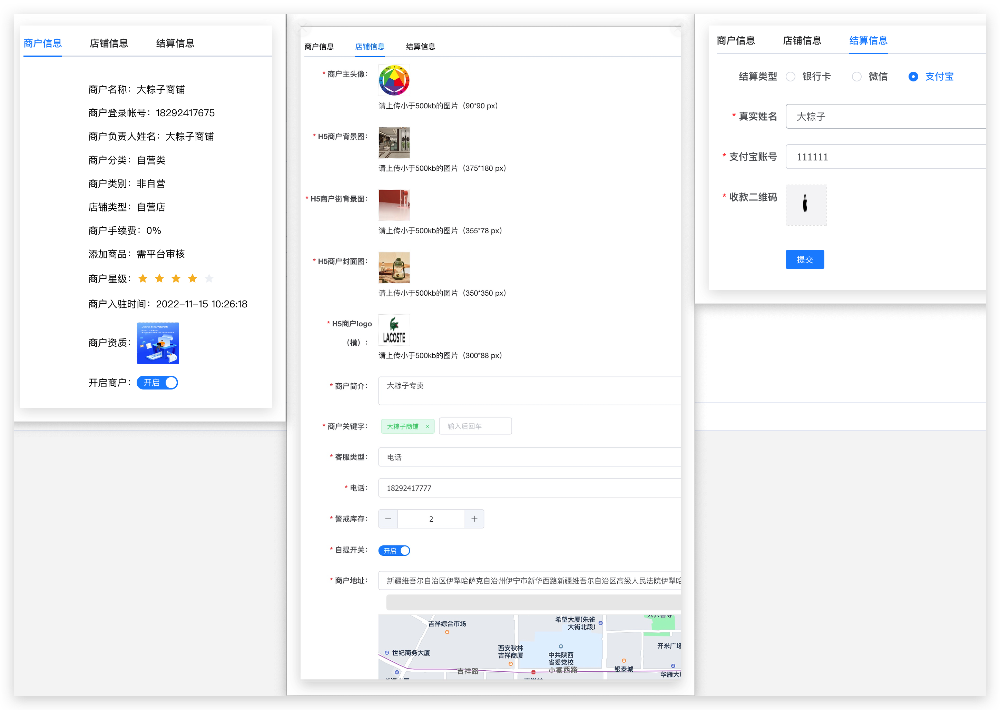

# 设置

## 商户基本设置

图片示例：

### 商户信息：申请时填写的信息

​	**以表单显示的数据**【不可修改】

​		商户名称，商户帐号，商户法人，商户分类，商户类别，店铺类型，商户手续费，商品是否审核，商户星级，入驻时间，资质图片。

​	**开启店铺**：是 / 否

​	

### 店铺信息

**宗旨**：表单配置的店铺信息，商户可以根据自己需求随时更改

**表单信息**：商户主头像，商户背景图，推荐店铺背景图，商户封面，商户logo，商户简介，客服（暂放），库存告警，是否自体（是否），商户地址（web端地图定位）

### 结算信息：盈利后清算需要用到

**结算类型**：银行卡，微信，支付宝

**银行卡**：收款人，开户银行【国内各大银行选择】，卡号，开户行地址

**微信**：真实姓名，微信号，收款二维码

**支付宝**：真实姓名，支付宝帐号，收款二维码

## 运费模版

## 管理权限

花和尚用里的satoken这里可以好好玩，逻辑实现清晰即可

# 维护

## 素材管理

## 敏感操作日志
